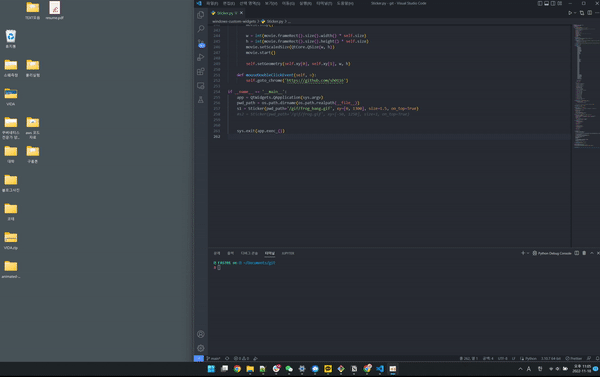

# windows-custom-widgets
Pyqt5 - Windows Custom GIF Widget  
윈도우 커스텀 바탕화면 위젯 생성 (스티커)
## 동작 방법

스크립트 동작 시 GIF폴더에서 선택한 GIF가 바탕화면에 출력된다.  
더블 클릭 시 원하는 사이트(크롬)으로 접속이 가능하고 
더 많은 기능을 원하면 추가가능하다  
예제 ) V+Click은 vscode를 켜는 기능
